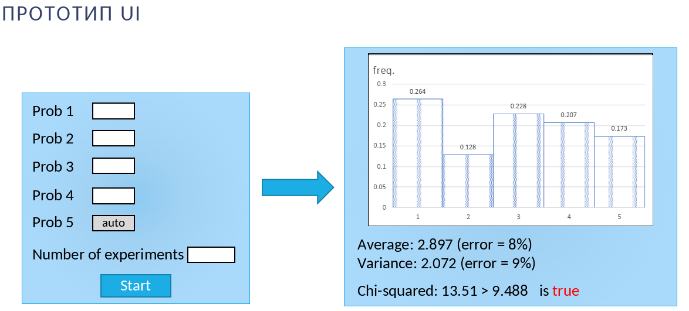

# Задание
#### lab06-1
**Задание:**
- Реализовать алгоритм проведения серии экспериментов по генерации дискретной случайной величины, заданной рядом распределения
- Вычислить эмпирические вероятности, выборочные среднее и дисперсию, их относительные погрешности
- Вычислить статистику хи-квадрат и применить критерий хи-квадрат при разных объемах выборки N  (N = 10, 100, 1 000, 10 000)
- Сделать вывод

Пример GUI:


#### lab06-2
**Задание:**
- Выполнить моделирование нормальной случайной величины любым методом. Провести статистическую обработку результатов:
	- построить гистограмму; 
	- оценить точность (относительные погрешности, критерий хи-квадрат) для объемов выборки 10, 100, 1000, 10000;
   	- сделать вывод.
	
Пример GUI:	


# Лабораторная работа №6: Имитационное моделирование случайных величин

**Тема:** Моделирование дискретных и непрерывных случайных величин

---

## Описание

Лабораторная работа посвящена имитационному моделированию двух типов случайных величин:

1. **Дискретная случайная величина** — моделирование с заданными вероятностями исходов
2. **Непрерывная случайная величина (нормальное распределение)** — генерация значений по методу Бокса-Мюллера

---

## Структура проекта

```
lab06/
└── Lab6/
    ├── Lab6.sln              # Решение Visual Studio
    └── Lab6/
        ├── Program.cs        # Точка входа приложения
        ├── FormMainMenu.cs   # Главное меню выбора работ
        ├── FormLab6_1.cs     # Дискретная СВ
        ├── FormLab6_2.cs     # Нормальная СВ
        └── Form1.cs          # Альтернативный интерфейс с вкладками
```

---

## Функционал

### Lab 06-1: Дискретная случайная величина

**Цель:** Моделирование дискретной СВ с 5 возможными исходами.

**Возможности:**
- Ввод вероятностей для первых 4 исходов
- Автоматический расчёт 5-й вероятности (как остаток до 1)
- Задание объёма выборки
- Построение гистограммы эмпирических частот
- Расчёт теоретического и эмпирического математического ожидания
- Расчёт теоретической и эмпирической дисперсии

**Формулы:**
- Математическое ожидание: `M[X] = Σ(xᵢ × pᵢ)`
- Дисперсия: `D[X] = Σ((xᵢ - M[X])² × pᵢ)`

---

### Lab 06-2: Нормальная случайная величина

**Цель:** Генерация нормально распределённых случайных величин методом Бокса-Мюллера.

**Возможности:**
- Ввод математического ожидания (μ)
- Ввод дисперсии (σ²)
- Задание объёма выборки
- Построение гистограммы полученных значений
- Наложение теоретической кривой нормального распределения
- Сравнение теоретических и эмпирических характеристик

**Метод Бокса-Мюллера:**
```
Z₀ = √(-2 × ln(U₁)) × cos(2π × U₂)
Z₁ = √(-2 × ln(U₁)) × sin(2π × U₂)
```
где U₁, U₂ — независимые равномерные случайные величины на [0, 1].

Затем выполняется преобразование к заданным параметрам:
```
X = μ + σ × Z
```

---

## Запуск проекта

### Требования
- .NET Framework / .NET SDK
- Visual Studio 2019 или новее (рекомендуется)

### Инструкция

1. Откройте решение `Lab6/Lab6.sln` в Visual Studio
2. Соберите проект (Ctrl+Shift+B)
3. Запустите отладку (F5)

Или через командную строку:
```bash
cd lab06/Lab6/Lab6
dotnet run
```

---

## Интерфейс

При запуске открывается главное меню с выбором одной из двух лабораторных работ:

- **Lab 06-1: Дискретная СВ** — моделирование дискретного распределения
- **Lab 06-2: Нормальная СВ** — моделирование нормального распределения

Каждая работа открывается в отдельном окне с панелью ввода параметров, кнопками управления и графиком результатов.

---

## Отчётность

**В отчёт необходимо включить:**

1. Титульный лист
2. Цель работы
3. Краткие теоретические сведения
4. Листинг кода (основные фрагменты)
5. Скриншоты интерфейса с результатами моделирования
6. Таблицы с теоретическими и эмпирическими характеристиками
7. Выводы о соответствии эмпирических данных теоретическим

---

## Контрольные вопросы

1. Что такое случайная величина? Какие типы СВ существуют?
2. Как определяется функция распределения вероятностей?
3. Что такое математическое ожидание и дисперсия?
4. Опишите метод Бокса-Мюллера для генерации нормальных СВ
5. Почему при увеличении объёма выборки эмпирические характеристики приближаются к теоретическим?
6. Как проверить, что сумма вероятностей равна 1?
7. В чём разница между частотой и вероятностью?

---

## Примечания

- Для корректной работы графиков требуется компонент `System.Windows.Forms.DataVisualization.Charting`
- При вводе вероятностей убедитесь, что их сумма не превышает 1
- Рекомендуется использовать объём выборки не менее 1000 для получения статистически значимых результатов
### Имитационное моделирование дискретных случайных величин (GUI)

