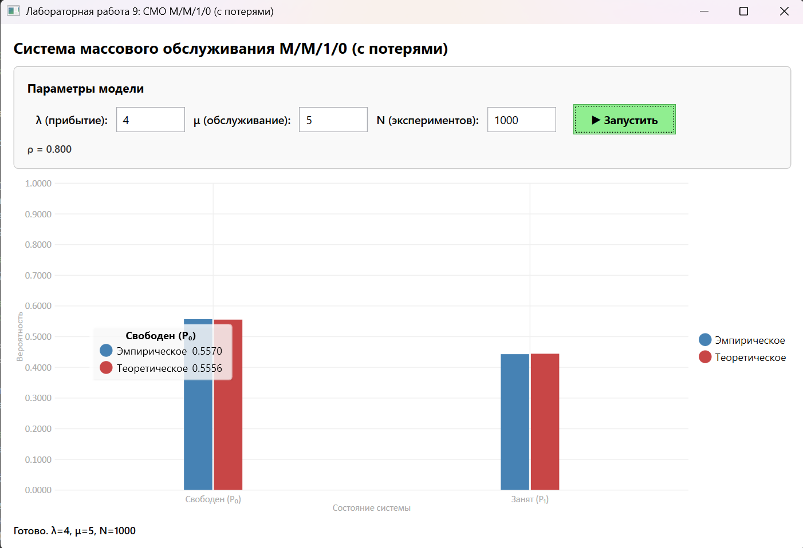
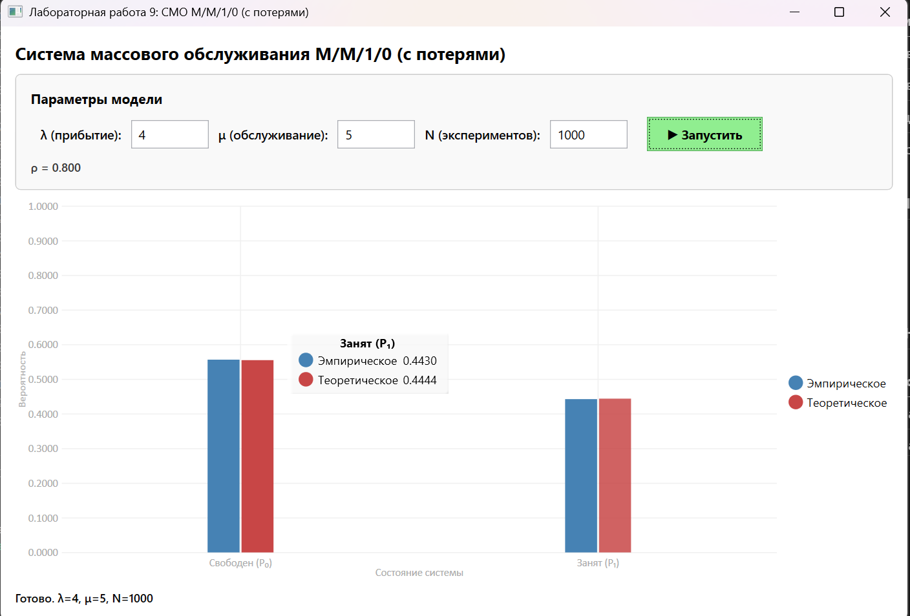

# Лабораторная работа: СМО M/M/1/0 (система с потерями)
## Пример работы программы

## Параметры модели
| Параметр | Значение | Описание |
|----------|----------|----------|
| `λ` | 4 | Интенсивность входного потока |
| `μ` | 5 | Интенсивность обслуживания |
| `ρ = λ/μ` | 0.8 | Коэффициент загрузки |
| `N` | 1000 | Число моделируемых заявок |

## Теоретические значения (формулы Эрланга)
$$ P_0 = \frac{1}{1 + \rho} = \frac{1}{1.8} \approx 0.5556 $$
$$ P_1 = \frac{\rho}{1 + \rho} = \frac{0.8}{1.8} \approx 0.4444 $$

## Результаты моделирования
| Метрика | Теория | Эксперимент | Погрешность |
|---------|--------|-------------|-------------|
| **P₀ (свободен)** | 0.5556 | 0.5570 | 0.25% |
| **P₁ (отказ)** | 0.4444 | 0.4430 | 0.31% |

## Вывод
Эмпирические результаты хорошо согласуются с теоретическими (погрешность < 1%). Это подтверждает корректность реализации алгоритма моделирования событий и справедливость формул  для системы с потерями при заданных параметрах нагрузки ($\rho = 0.8$).